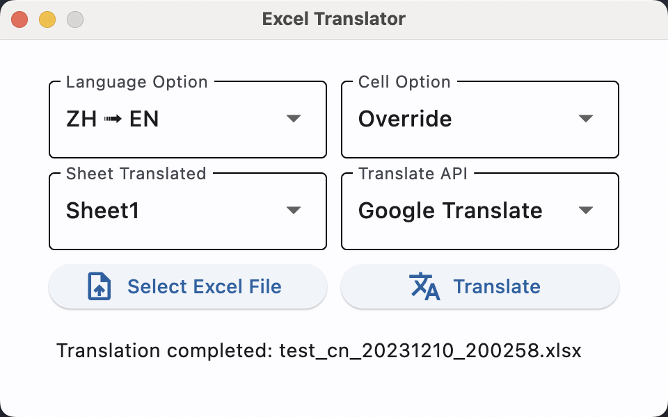
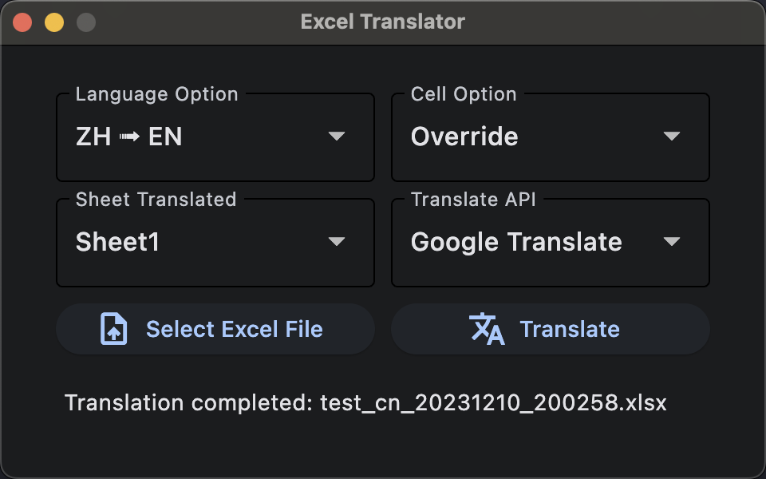

# Excel-trans

`python 3.11` with `Flet`

Etranslate Excel files and keep the original cell format.

## What's it looking like?




## How to use?

Download binary from release or clone this repository run with python.

## As a Developer

```shell
# 1. Clone this project.
$ git clone https://github.com/gymgle/excel-trans.git

# 2. Install pip requirements. 
$ cd excel-trans

# 建立虛擬環境
$ python -m venv ./venv

# 切換虛擬環境
# in windows 須執行 ${env_name}/Scripts/activate.ps1
$ ./venv/Scripts/activate.ps1

# in mac and linux, 使用 source 指令執行路徑 ${env_name}/bin/activate
$ source ./venv/bin/activate

$ pip3 install -r requirements.txt

# 3. Try it!
$ python main.py
```

## How to Build?

Build Windows/Linux/macOS executable binary file via PyInstaller.

1. Install PyInstaller
    ``` shell
    # 打包工具
    $ pip install pyinstaller

    # 打包時自動將png轉成對應平台的icon
    $ pip install pillow
    ```

2. Prepare UPX (Optional)

    Download UPX [Here](https://github.com/upx/upx/releases), put `upx.exe` (Windows) to project dir.

3. Package project
    ```shell
    $ flet pack main.py

    # 如果需要icon 跟 換name
    $ flet pack main.py --icon ./icon.png --name excel-trans 
    ```

You can find the packaged `main` in `dist` dir.
